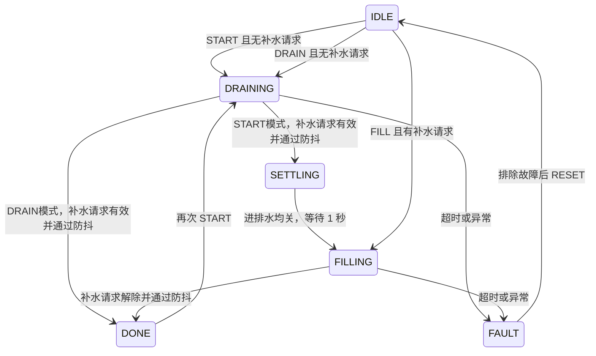

# 手动开关控制（0.8.0）

默认`water_config.mode="manual"`，补水接DO2/GPIO23，放水接出纸口/GPIO5。两路可以同时开启，且分别控制；没有水位传感器也可使用，need_fill引脚不初始化、不读取，报告unknown。

| 命令 | 行为 |
| --- | --- |
| FILL | 开启补水，放水保持原状态 |
| DRAIN | 开启放水，补水保持原状态 |
| FILL_OFF | 关闭补水，放水保持原状态 |
| DRAIN_OFF | 关闭放水，补水保持原状态 |
| STOP | 关闭全部输出 |
| RESET | 原因解除后复位故障，不重新开水 |

两路都开时状态为EXCHANGING；网页显示“补水与排水同时进行”，两个开关分别发送对应OFF命令。保留停止全部输出按钮。旧固件保持原互锁和同一开关发送STOP的行为，须更新0.8.0才能使用并行控制。

每路最多120秒，从该路实际开启开始计时；重复开启不会续期，开/关另一路不重置计时。任一路超时会关闭全部并锁存FAULT，需复位后重新开启。远程10秒失联、溢水输入或IO异常同样尝试关断全部；重连不恢复输出。GPIO12在任意一路开启时常亮；已连服务器且待机时，每次有效心跳回执亮200ms、正常30秒一次；未联网或连接失败时恢复原网络闪烁。短闪不会打断工作常亮，也不增加心跳或流量。

开启为pins.setup LOW后写HIGH；关闭仍是写LOW后pins.close。改变一路时不重新写入另一条仍开启的输出。LOW失败仍尝试close；关断或轮询定时器失败时禁止继续开水，需重启恢复。上电先关闭两路，不自动开水。12V/6.1V是历史接口测量，不是模组逻辑电压或同时负载验收。

源码及生成包0.8.0，8Lua+CA，原CORE与默认库不变，见[Web与4G接入](web-console.md)。本地模拟/浏览器测试通过，尚未以0.8.0操作真实输出。用户当前只要求软件开关，不以水流测量作为本阶段前提。

## 自动液位控制参考（需显式配置mode=automatic）

以下为保留的自动液位模式参考，使用既有 Air724UG V4035 FLOAT / LuaTask V2.4.4。本地USB控制无需SIM或网络，网页控制需4G联网；通过命令启动一轮，重启后待机，不恢复未完成的换水。还未加入定时计划或持续自动补水。

## 液位板的信号

根据用户提供的 12V 液位板接线图，A 是最低公共探针，B 是下限，C 是上限。水位低于 B 后继电器请求补水，到 C 后解除请求。B 与 C 之间保持之前的状态，因此只有一个带记忆的 `need_fill` 信号：

- `true`：补水请求有效，持续到水面触及 C。
- `false`：补水请求无效，持续到水面降至 B 以下。

这个信号不能报告水深、百分比，也不能在开机时单凭 `false` 证明水已在 C。开始换水前应确认探针位置及液位板的实际工作状态；`START` 只检查信号稳定且没有补水请求。

## 一轮流程



`DONE` 保持关闭，不开始下一轮。任意运行阶段 `STOP` 都尝试关断两个输出；故障已经锁存时仍保留 `FAULT`，须显式 `RESET`。复位只回到待机，不重新启动泵。额外超高输入在任何状态触发都会锁存故障。

读取液位每 100ms 一次，正常液位转换防抖 500ms，排水转补水间隔 1000ms。排水、补水超时各为 120000ms；这些是初始参数，必须按实际容积和流量调整。软件的停机响应依赖 Lua 事件循环正常运行，不能代替独立硬件限位。

## 接线与配置

当前默认manual且两路输出映射已启用。要使用下述automatic流程，须显式设置mode并配置和确认液位输入；不能只改mode而沿用未配置的need_fill。未确认映射时进入UNCONFIGURED，不扫描未知引脚。

| 配置 | 实际含义 |
| --- | --- |
| `outputs.fill` | 补水泵或进水阀的控制输出：GPIO、实测开启和关闭电平 |
| `outputs.drain` | 排水泵或排水阀的控制输出：GPIO、实测开启和关闭电平 |
| `inputs.need_fill` | 液位板继电器隔离反馈：GPIO、请求补水时的电平、上下拉 |
| `inputs.overflow` | 可选额外超高输入，默认禁用；填写 GPIO、触发电平和上下拉 |
| `timing` | 防抖、切换等待、排水及补水超时，单位 ms |

启用前应先确认下面这些实际连接，然后才把三个确认/使能开关设为 `true`：

1. 补水和排水各自能被对应输出独立关断；验证上电、运行、STOP 的实际表现。液位板的自动补水接线必须受补水许可约束，不能绕过控制器自行启动泵，否则排水时会同时补水。
2. 液位板供电与 Air724 输入接口分清。卖家图的 12V 是液位板供电，图中继电器另一侧接了市电泵。不能把该泵侧带电触点、12V 或 A/B/C 电极直接接 Air724 的 1.8V GPIO。只使用确认隔离、没有外来电压的干接点，或匹配 1.8V 的隔离反馈电路。
3. 干接点使用 COM 接逻辑地、NO 接上拉输入时，通常闭合读 0；仍须实测“请求补水”对应的触点状态后填写 `active_level`。程序未预填该极性。
4. 实测低于 B、到 C 及 B/C 之间的保持行为。电极、水质和控制板供电必须能可靠检测。单路普通触点无法可靠区分断线、控制板失电与正常的某一状态；超时不能覆盖全部溢流风险。

当前适配器只接纳固定 1.8V 域且已有资料支持的 GPIO：`5,9,10,11,13,14,15,17,18,19,22,23`（GPIO12保留给网络灯）。这是可配置集合，不代表这些脚在定制板上空闲。输入、输出必须各用不同 GPIO。未自动处理 LDO、物理 UART 或 SIM 复用；选脚前须核对现有外围，尤其 GPIO23 的 SIM 在位检测和 GPIO13 的启动条件。

已有测量不能直接填成泵映射：GPIO5 HIGH 时出纸口约 6.1V，LOW 未确认；GPIO12 对应板灯；GPIO23 的 DO2 在 HIGH/LOW 阶段均约 12V，而 STOP 后约 0V，尚未分清写 LOW 与释放引脚的效果。新程序使用明确的 `off_level` 保持关断，不以释放 GPIO 作为关断方式。

可选 `overflow` 是软件额外输入，不等于独立硬件断水。若启用，超高触发不等待正常防抖，最迟在下一次有效轮询/命令采样时关断；解除后需稳定 500ms 才允许 RESET。失电关闭的阀、独立硬件断流方案须另按实际设备确定。

## USB 使用与状态

下表说明automatic模式的液位流程；当前manual模式的独立开关命令见本文开头。

使用新工具，COM 编号以当前枚举为准：

```powershell
powershell -NoProfile -ExecutionPolicy Bypass -File .\tools\water-command.ps1 -Port COM4 -Command STATUS
```

| 命令 | 行为 |
| --- | --- |
| `STATUS` | 查询状态，不启动输出 |
| `START` | 手动启动一次“排水→补水”；有补水请求时拒绝，先处理初始水位 |
| `FILL` | 有补水请求时，只补水到 C；适合首次加水 |
| `DRAIN` | 单独冲水：排到B低位后停止，不自动补水；已请求补水时拒绝 |
| `STOP` | 取消当前运行并尝试关断两个输出，继续监测输入 |
| `RESET` | 故障原因解除且输入重新稳定后，清除锁存并待机 |

将示例命令最后的 `STATUS` 替换为所需命令即可。主机先核对项目及版本，避免把 `START` 发给旧电机测试程序。不使用旧 `motor-command.ps1` / `gpio-probe.ps1` 操作新版。

开机立即打印 `WATER STATUS`，之后每 5 秒一次；状态变化也打印。USB 命令响应带 `OK`/`ERROR`，USB 控制口不可用时不初始化输出。`ready=1` 表示配置、轮询和输入稳定条件具备，不表示水一定到 C；正在运行时重复 START 仍返回 `busy`。

`fill`、`drain` 是软件输出记录，不是板端电压/水流反馈；写入失败时可能保留最后的开启请求。`outputs_known=0` 表示输出尚未初始化或写入结果不确定，此时不能据 `fill=0` 推断硬件已断电。故障原因会保留原始原因，并附加关断失败信息。

`drain_timeout`、`fill_timeout`、`overflow`、传感器读取错误等会锁存为 `FAULT`。关断失败时两个输出都会独立尝试关闭，不能仅凭 STOP 应答代替电压确认。轮询定时器失效后禁止重新 START/FILL/DRAIN，修复问题后重启应用；普通传感器故障则可恢复稳定后 RESET。

## 下载与验证边界

LuaTools选择water-online-0.8.0项目，使用build/firmware/flash-files.txt中的完整8个Lua文件和1个CA证书，保留既有CORE、默认库及USB trace。准备与验证步骤见[Web与4G接入](web-console.md)。旧water-exchange的5文件清单不包含网络功能，不能用于当前联网版本。由用户点击下载脚本；此前Escape停止的桌面输入未恢复。

本地208项Lua、78项Python和浏览器联调通过，覆盖并行开关、各路计时、故障与端到端命令交付。GPIO测试均为模拟，最近实板日志为0.7.7/manual/IDLE、两路关闭；0.8.0仍待下载验证。实际泵、探针测试不在本阶段范围内。
